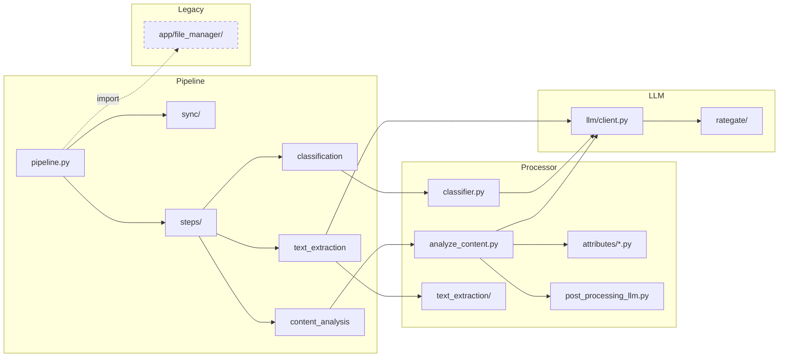

# Composants

## Inventaire des composants applicatifs

### Arbre des modules

```
docia/                              # Application Django principale
├── auth/                           # Authentification OIDC
│   ├── backends.py                 # Backend ProConnect / LaSuite
│   └── views.py                    # Vues login/logout
├── common/models.py                # BaseModel, User
├── documents/models.py             # DataEngagement, Document, EngagementScope
├── file_processing/
│   ├── llm/
│   │   ├── client.py               # LLMClient (ask_llm + ocr_pdf)
│   │   └── rategate/               # Rate limiting distribué (PostgreSQL)
│   ├── models.py                   # ProcessDocumentBatch/Job/Step, FileInfo, etc.
│   ├── pipeline/
│   │   ├── pipeline.py             # Orchestration : sync_and_analyze, launch_batch
│   │   ├── steps/
│   │   │   ├── base.py             # AbstractStepRunner
│   │   │   ├── text_extraction.py  # Étape 1
│   │   │   ├── classification.py   # Étape 2
│   │   │   └── content_analysis.py # Étape 3
│   │   └── utils.py                # Suivi progression batch
│   ├── processor/
│   │   ├── analyze_content.py      # Extraction info structurée via LLM
│   │   ├── attributes/             # Définition des champs par type de document
│   │   ├── attributes_query.py     # DataFrame des attributs
│   │   ├── classifier.py           # Classification LLM + catalogue catégories
│   │   ├── post_processing_llm.py  # Post-traitement (IBAN, SIRET, montants)
│   │   ├── pdf_drawings.py         # Détection cases cochées
│   │   └── text_extraction/        # Dispatch par format fichier
│   └── sync/
│       ├── client.py               # Client API externe (OAuth2)
│       ├── downloader.py           # Téléchargement documents → S3
│       ├── sync_engagements.py     # Sync EJ
│       ├── sync_metadata.py        # Sync métadonnées PJ
│       └── workflow.py             # Orchestration sync
├── management/commands/
│   ├── launch_pipeline.py          # Commande cron principale
│   ├── display_batch_progress.py   # Affichage progression
│   └── sync_engagement_items.py    # Sync items EJ
├── migrations/                     # ~30 migrations Django
├── permissions/                    # Vérification droits utilisateur sur EJ
├── ratelimit/                      # Rate limiting web (200 req/jour)
├── templates/                      # Templates DSFR (vue 360°)
└── tracking/                       # Événements de suivi

app/                                # Code legacy (pré-Django)
├── ai_models/config_albert.py      # Config Albert legacy
├── data/sql/                       # Requêtes SQL legacy
├── file_manager/                   # extract_num_EJ, clean_nul_bytes (encore importé)
├── grist/grist_api.py              # API Grist
├── models/                         # Modèles SQLAlchemy legacy
└── processor/                      # Prompts legacy (select_relevant_content)
```

### Tableau des composants

| Composant | Module | Responsabilité | Dépendances externes |
|---|---|---|---|
| **LLMClient** | `docia/file_processing/llm/client.py` | Appel LLM (chat completions) + OCR PDF | API Albert, SDK OpenAI, httpx (OCR client injectable) |
| **RateGate** | `docia/file_processing/llm/rategate/` | Espacement des requêtes LLM entre workers | PostgreSQL (`clock_timestamp()`) |
| **Pipeline Orchestrator** | `docia/file_processing/pipeline/pipeline.py` | Orchestration sync + batch Celery | Celery, Redis |
| **TextExtractStepRunner** | `docia/file_processing/pipeline/steps/text_extraction.py` | Extraction texte multi-format | PyMuPDF, Tesseract, LibreOffice, Mistral OCR |
| **ClassifyStepRunner** | `docia/file_processing/pipeline/steps/classification.py` | Classification du document (~50 catégories) | API Albert (openweight-medium = mistral-small) |
| **AnalyzeContentStepRunner** | `docia/file_processing/pipeline/steps/content_analysis.py` | Extraction structurée par type | API Albert (mistral-medium-2508) |
| **PostProcessing** | `docia/file_processing/processor/post_processing_llm.py` | Nettoyage IBAN, SIRET, montants, adresses | schwifty (IBAN) |
| **SyncClient** | `docia/file_processing/sync/client.py` | Client API Chorus/SAP (OData, OAuth2) | requests (`requests.Session`) |
| **Downloader** | `docia/file_processing/sync/downloader.py` | Téléchargement PJ → S3 | django-storages, S3 |
| **Vue 360°** | `docia/views.py`, `docia/templates/` | Interface web consultation par EJ | Django, DSFR |
| **Auth OIDC** | `docia/auth/backends.py` | Authentification ProConnect | mozilla-django-oidc, django-lasuite |

### Couplage entre composants



!!! warning "Code legacy encore importé"

    Certains fichiers du dossier `app/` sont exclus du linting ruff (`ruff.exclude` dans `pyproject.toml`), mais des fonctions sont encore importées dans le pipeline actif : `app.file_manager.cleaner`, `app.file_manager.extract_num_EJ`, `app.utils`, `app.data.sql.sql`. Ce couplage complique la migration.

    Fichiers exclus du linting (liste exacte) : `app/file_manager/__init__.py`, `app/file_manager/cleaner.py`, `app/file_manager/statistics.py`, `app/grist/__init__.py`, `app/grist/grist_api.py`, `app/processor/select_relevant_content.py`, `app/processor/synthesis.py`. Les autres fichiers de `app/` (dont `app/utils.py`, `app/data/sql/sql.py`) sont bien couverts par ruff.

**Source** : arborescence du repo, imports Python analysés statiquement.
