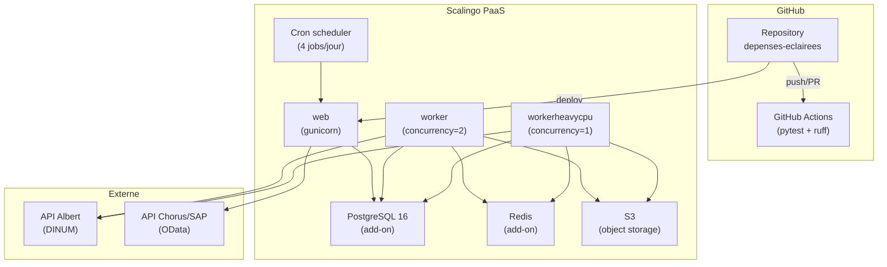

# Déploiement

## Plateforme

**Scalingo** — PaaS français, compatible 12-factor.

## Image Docker

Basée sur `scalingo/scalingo-24` (Ubuntu), définie dans `docker/Dockerfile-scalingo` :

| Couche | Détail |
|---|---|
| Image de base | `scalingo/scalingo-24` |
| Runtime | Python 3.13 |
| Gestionnaire de paquets | Poetry |
| Dépendances système (Aptfile) | `tesseract-ocr`, `tesseract-ocr-fra`, `libtesseract-dev`, `libreoffice-core-nogui`, `libreoffice-writer-nogui`, `libreoffice-java-common` |

!!! info "LibreOffice en production"

    LibreOffice est nécessaire pour convertir les anciens fichiers `.doc` en texte. Cela ajoute environ 200 Mo à l'image Docker.

## Procfile (processus Scalingo)

Défini dans `Procfile` :

| Processus | Commande | Rôle |
|---|---|---|
| `web` | `gunicorn --config gunicorn_conf.py docia.wsgi` | Application Django (vue 360°, API) |
| `worker` | `celery --app docia worker -l INFO -Q celery -n celery@%h --concurrency=2` | Tâches pipeline standard |
| `workerheavycpu` | `celery --app docia worker -l INFO -Q heavy_cpu -n heavy_cpu@%h --concurrency=1` | Tâches gourmandes (OCR) |
| `postdeploy` | `if [ "$DISABLE_MIGRATE" != "1" ]; then python manage.py migrate; fi` | Migration auto au déploiement (désactivable via `DISABLE_MIGRATE=1`) |

## Variables d'environnement

Relevées dans `example.env` et `docia/settings.py` :

| Variable | Rôle | Sensible |
|---|---|---|
| `DATABASE_URL` | URL PostgreSQL | Oui |
| `REDIS_URL` | URL Redis (broker Celery) | Oui |
| `ALBERT_API_KEY` | Clé API Albert (DINUM) | Oui |
| `ALBERT_BASE_URL` | URL de base API Albert | Non |
| `ALBERT_USE_RATE_LIMITER` | Active le rate limiting distribué | Non |
| `OIDC_OP_*` | Configuration OpenID Connect (ProConnect) | Oui |
| `AWS_ACCESS_KEY_ID` / `AWS_SECRET_ACCESS_KEY` | Credentials S3 | Oui |
| `AWS_STORAGE_BUCKET_NAME` | Nom du bucket S3 | Non |
| `DEFAULT_FILE_STORAGE` | `storages.backends.s3boto3.S3Boto3Storage` ou filesystem | Non |
| `SECRET_KEY` | Clé secrète Django | Oui |
| `SYNC_CLIENT_ID` / `SYNC_CLIENT_SECRET` | Credentials OAuth2 API Chorus | Oui |
| `SYNC_BASE_URL` / `SYNC_AUTH_URL` | URLs API Chorus/SAP | Non |

## Cron jobs

Définis dans `cron.json` :

```json
{
  "jobs": [
    {"command": "0 2,6,11 * * * python manage.py launch_pipeline --timedelta 7d"},
    {"command": "0 20 * * * python manage.py launch_pipeline --timedelta 7d --force-analyze"}
  ]
}
```

!!! info "Format Scalingo cron.json"

    Le format Scalingo embarque l'expression cron **à l'intérieur du champ `command`** (une seule chaîne). Ce n'est pas un tableau plat mais un objet `{"jobs": [...]}`. Plusieurs horaires peuvent être combinés en une seule expression (`0 2,6,11 * * *`).

## CI/CD

| Service | Fichier | Rôle |
|---|---|---|
| GitHub Actions | `.github/workflows/django.yml` | Voir étapes ci-dessous — sur PR et push `main` |

**Étapes du workflow CI dans l'ordre :**

| Étape | Commande |
|---|---|
| Vérification migrations manquantes | `python manage.py makemigrations --check --dry-run` |
| Lint | `ruff check` |
| Format | `ruff format --check` |
| Tests | `pytest --no-migrations tests` |

!!! warning "Tests e2e absents de la CI"

    Le workflow GitHub n'exécute que `pytest tests/`, pas `tests_e2e/`. Les tests de qualité d'extraction sont exécutés manuellement.

## Diagramme de déploiement



**Source** : `Procfile`, `cron.json`, `docker/Dockerfile-scalingo`, `Aptfile`, `example.env`, `docia/settings.py`
