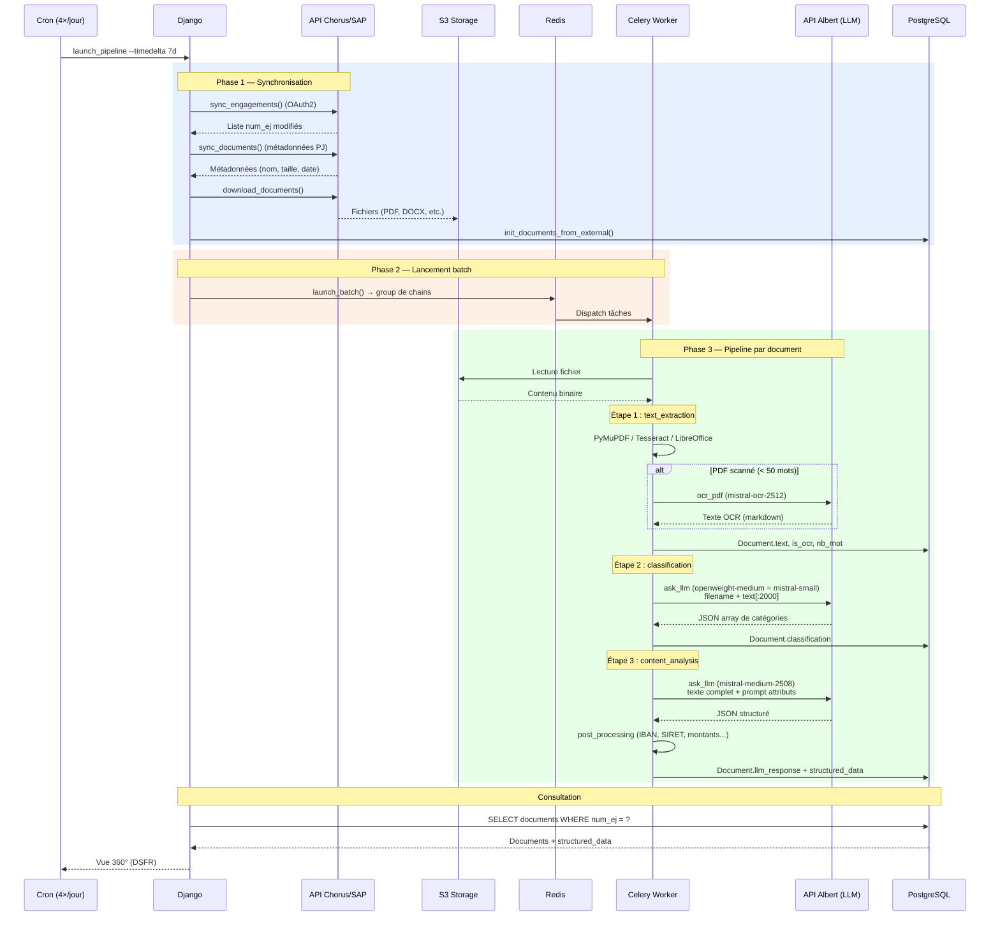
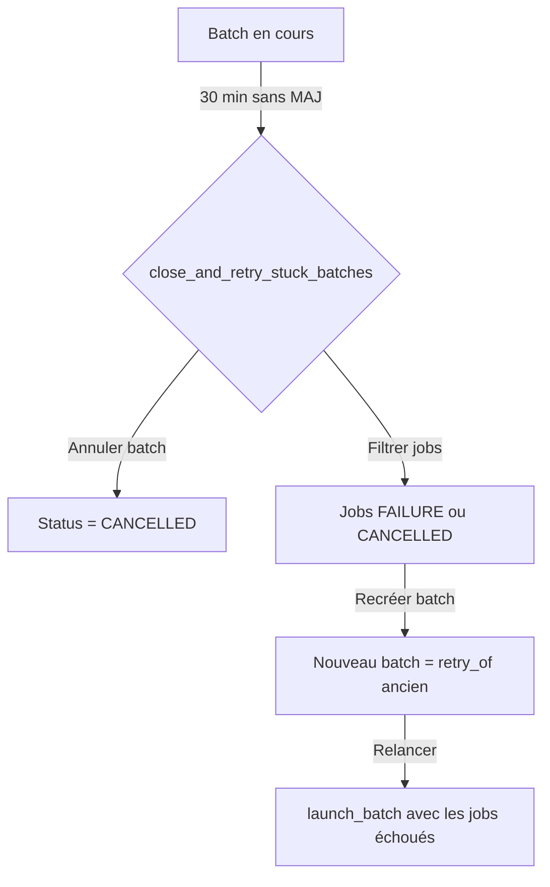

# Flux de données

## Séquence complète : de la synchronisation à la vue 360°

## Planification cron

Défini dans `cron.json` :

| Heure | Commande | Particularité |
|---|---|---|
| 02:00 | `launch_pipeline --timedelta 7d` | Incrémental (ne ré-analyse pas les documents déjà traités) |
| 06:00 | `launch_pipeline --timedelta 7d` | Incrémental |
| 11:00 | `launch_pipeline --timedelta 7d` | Incrémental |
| 20:00 | `launch_pipeline --timedelta 7d --force-analyze` | Force la ré-analyse de tous les documents |

## Mécanisme de retry des batchs

**Source** : `docia/file_processing/pipeline/pipeline.py`, `cron.json`
