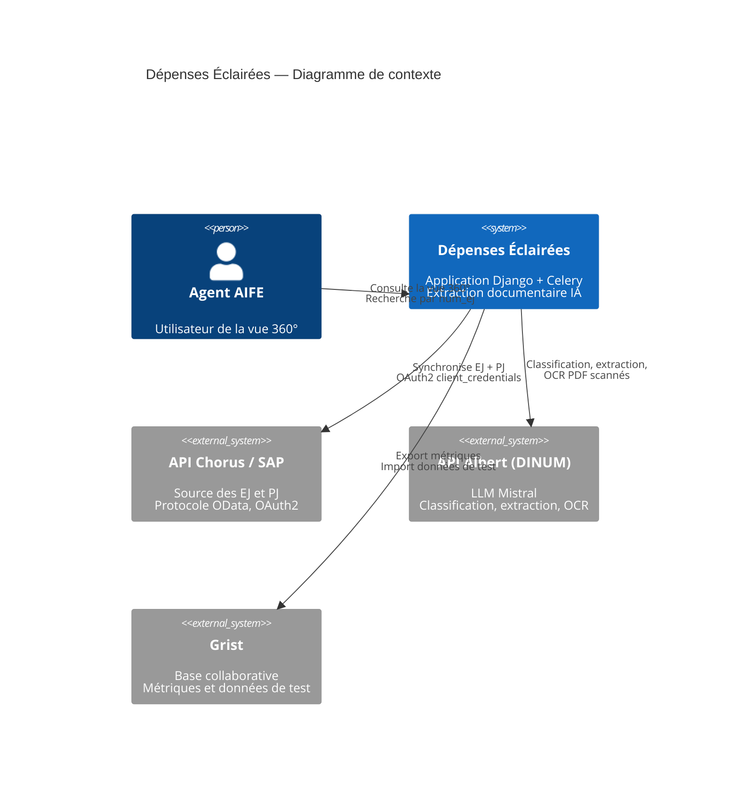
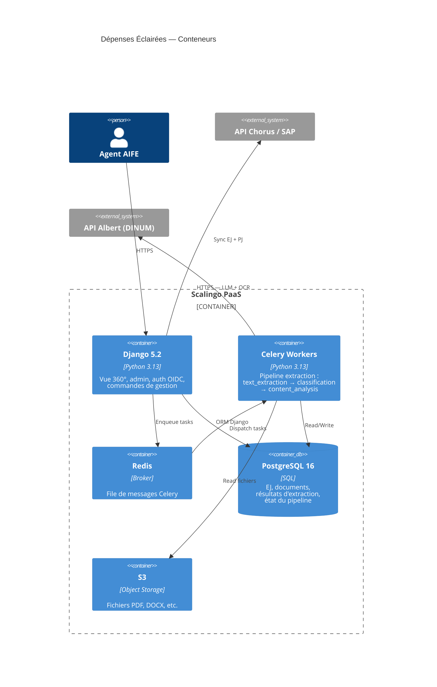

# Vue d'ensemble de l'architecture

## Diagramme C4 — Niveau Contexte

## Diagramme C4 — Niveau Conteneur

## Stack technique

| Couche | Technologie | Version | Source |
|---|---|---|---|
| Langage | Python | ~3.13 | `pyproject.toml` |
| Framework web | Django | ~5.2 | `pyproject.toml` |
| API REST | Django REST Framework | ~3.16 | `pyproject.toml` |
| File d'attente | Celery + Redis | ≥5.5.3 | `pyproject.toml`, `Procfile` |
| Base de données | PostgreSQL | 16 (CI) | `ci.env` |
| OCR local | Tesseract (tesserocr) | ≥2.9.1 | `pyproject.toml`, `Aptfile` |
| OCR distant | Mistral OCR via Albert API | mistral-ocr-2512 | `docia/file_processing/llm/client.py` |
| LLM | OpenAI SDK → Albert (Mistral) | openweight-medium (alias: mistral-small), mistral-medium-2508 | `docia/file_processing/llm/client.py` |
| PDF | PyMuPDF (pymupdf) | — | `pyproject.toml` |
| Auth | mozilla-django-oidc + django-lasuite | — | `pyproject.toml` |
| Stockage fichiers | django-storages (S3) ou FileSystem | — | `pyproject.toml`, `docia/settings.py` |
| UI | Django DSFR | ≥3.2 | `pyproject.toml` |
| Gestion dépendances | Poetry | — | `pyproject.toml` |

## Dépendances notables

| Paquet | Usage |
|---|---|
| `openai` | Client SDK pour appeler l'API Albert via le protocole OpenAI |
| `schwifty` | Validation IBAN (ISO 13616) |
| `tesserocr` + `Pillow` | OCR local Tesseract pour images |
| `pymupdf` | Extraction texte PDF natif + rendu pixmap pour OCR |
| `docx2txt`, `openpyxl`, `xlrd`, `olefile` | Extraction texte doc/xls/ods |

!!! warning "Dépendances inutilisées en production"

    `faiss-cpu`, `scikit-learn`, `tiktoken`, `ipykernel`, `jupyter` sont dans les dépendances de production mais semblent être des vestiges de l'ancienne approche RAG/embedding. Elles ne sont pas utilisées dans le pipeline actuel.

**Source** : `pyproject.toml`, `Aptfile`, `docia/settings.py`
