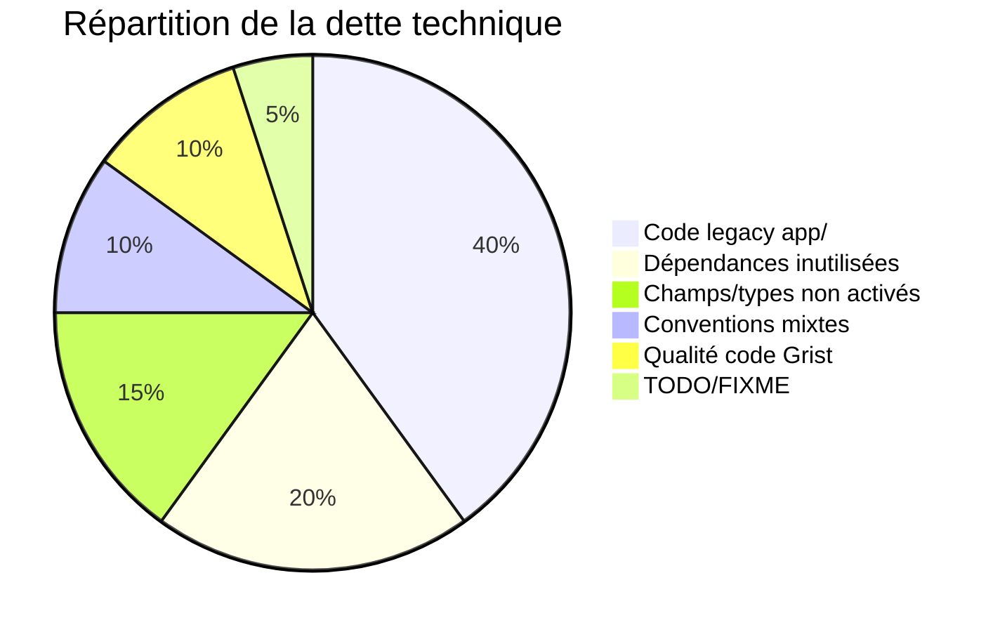

# Dette technique

## Vue d'ensemble

La dette technique du projet est principalement **structurelle**, liée à la coexistence de code legacy (pré-Django) et de code moderne (Django/Celery).

## 1. Code legacy `app/`

| Aspect | Détail |
|---|---|
| **Localisation** | `app/` (tout le dossier) |
| **Nature** | Code pré-Django : SQLAlchemy, pandas, fonctions standalone |
| **Exclusion linting** | Certains fichiers exclus de `ruff.exclude` dans `pyproject.toml` (voir liste ci-dessous) |
| **Encore importé** | `app.file_manager.cleaner`, `app.file_manager.extract_num_EJ`, `app.utils`, `app.data.sql.sql` |
| **Impact** | Bypass du framework Django (print au lieu de logging, pas de gestion d'erreurs standard) |

**Fichiers de `app/` exclus du linting ruff (liste exacte issu de `pyproject.toml`) :**

```
app/file_manager/__init__.py
app/file_manager/cleaner.py
app/file_manager/statistics.py
app/grist/__init__.py
app/grist/grist_api.py
app/processor/select_relevant_content.py
app/processor/synthesis.py
```

!!! warning "À noter"

    `app/utils.py` et `app/data/sql/sql.py` **ne sont pas** dans `ruff.exclude` et sont donc couverts par le linting, bien qu'ils appartiennent au code legacy.

### Fichiers legacy encore utilisés

```
app/file_manager/cleaner.py         → importé dans le pipeline actif
app/file_manager/__init__.py        → extract_num_EJ exporté
app/utils.py                        → fonctions utilitaires importées
app/grist/grist_api.py              → utilisé par tests e2e et scripts
app/data/sql/sql.py                 → bulk_update_attachments (legacy classifier)
```

### Fichiers legacy probablement morts

```
app/ai_models/config_albert.py      → probablement remplacé par docia/settings.py
app/models/marche.py                → modèle SQLAlchemy legacy
app/models/tiers.py                 → modèle SQLAlchemy legacy
app/processor/select_relevant_content.py → ancienne approche RAG
app/processor/synthesis.py          → ancien prompt de synthèse
```

## 2. Dépendances inutilisées

| Paquet | Probable usage legacy | Taille estimée |
|---|---|---|
| `faiss-cpu` | Ancienne approche RAG/embedding | ~100 Mo |
| `scikit-learn` | Ancienne approche embedding | ~50 Mo |
| `tiktoken` | Comptage tokens (non utilisé) | ~10 Mo |
| `ipykernel` | Jupyter notebooks dev | ~5 Mo |
| `jupyter` | Notebooks dev | ~50 Mo |

## 3. `cctp` : attributs sans extraction

Le fichier `docia/file_processing/processor/attributes/cctp.py` définit les attributs CCTP, mais `cctp` est **absent de `SUPPORTED_DOCUMENT_TYPES`**. Le code est prêt mais jamais exécuté.

## 4. `relevant_content` : champ fantôme

Le champ `Document.relevant_content` est :

- Défini dans le modèle (`TextField, null=True`)
- Utilisé dans `AnalyzeContentStepRunner` : `document.relevant_content or document.text`
- **Jamais peuplé** par le pipeline actuel

C'est un vestige de l'ancienne approche RAG/embedding de sélection de contenu pertinent.

## 5. Conventions de nommage mixtes

| Convention | Tables |
|---|---|
| `docia_*` (Django standard) | `docia_document`, `docia_processdocumentbatch`, `docia_user`, etc. |
| Nom personnalisé (`Meta.db_table`) | `engagements`, `engagements_items`, `batch`, `programmes_ministeriels` |

## 6. Code Grist avec bare except

**Fichier** : `app/grist/grist_api.py`

- Utilise `requests` avec des `except:` nues (bare except)
- Utilise `print()` au lieu de `logging`
- Non couvert par ruff (exclu)

## 7. TODO/FIXME dans le code

| Fichier | Commentaire |
|---|---|
| `tests/docia/file_processing/sync/test_client.py:14` | `# TODO` (isolé, sans description) |

## Résumé de la dette



**Source** : `app/`, `pyproject.toml` (ruff.exclude), `docia/documents/models.py`, `docia/file_processing/processor/attributes/cctp.py`
