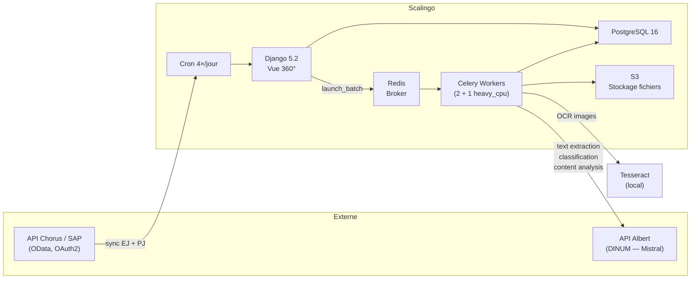

# Dépenses Éclairées — Rétro-documentation

**Projet BetaGouv**, en cours de reprise par l'AIFE vers SAP.

Ce site documente l'architecture, le pipeline d'extraction documentaire et le modèle de données de l'application **Dépenses Éclairées** tels qu'observés dans le code source (branche `main`, commit [`278138d`](https://github.com/betagouv/depenses-eclairees/commit/278138dc2372c886093875bbfff6090aad1f49a8)).

---

## Vue synthétique du système

## Composants principaux

| Composant | Rôle | Source |
|---|---|---|
| **Django (docia)** | Application web (vue 360°, admin, auth OIDC), ORM, commandes de gestion | `docia/` |
| **Celery workers** | Exécution parallèle du pipeline de traitement documentaire | `docia/file_processing/pipeline/` |
| **Redis** | Broker de messages pour Celery | `Procfile` |
| **PostgreSQL 16** | Base de données relationnelle (documents, EJ, résultats d'extraction) | `docia/models.py`, migrations |
| **S3 (Scalingo)** | Stockage des fichiers documents (PDF, DOCX, etc.) | `docia/settings.py` |
| **API Albert (DINUM)** | LLM Mistral (classification, extraction structurée) + OCR Mistral | `docia/file_processing/llm/client.py` |
| **Tesseract** | OCR local pour images (fallback) | `Aptfile` |
| **LibreOffice** | Conversion `.doc` → `.txt` | `Aptfile` |
| **API Chorus/SAP** | Source des EJ et des pièces jointes (synchronisation OData) | `docia/file_processing/sync/` |
| **Grist** | Base collaborative pour métriques et données de test e2e | `app/grist/grist_api.py` |

## Les 5 risques principaux

!!! danger "Risques identifiés lors de l'audit"

    1. **Dépendance monopoint sur Albert** — L'intégralité du pipeline dépend d'une seule API LLM sans fallback.
    2. **Absence de score de confiance** — Le seul score de complétude ne permet pas de qualifier la fiabilité des extractions.
    3. **Pas de contrôle de la taille du contexte LLM** — Le texte intégral est envoyé sans vérification du nombre de tokens.
    4. **Code legacy non migré** — Le dossier `app/` contient du code pré-Django encore importé.
    5. **Tests de qualité non automatisés** — Les tests e2e ne sont pas exécutés en CI.

## Navigation par atelier

| Atelier | Public | Pages clés |
|---|---|---|
| [Atelier 1 — Connexion LLM](ateliers/atelier-1-connexion-llm.md) | Équipe SAP / Prestataire | [Appel LLM](pipeline/appel-llm.md), [Prompts](pipeline/prompts.md) |
| [Atelier 2 — Extraction & Qualité](ateliers/atelier-2-extraction-qualite.md) | AIFE + Prestataire | [Contrat JSON](modele-donnees/contrat-interface-json.md), [Matrice qualité](qualite/matrice-qualite.md) |
| [Atelier 3 — Sizing](ateliers/atelier-3-sizing.md) | Architectes SAP | [Déploiement](architecture/deploiement.md), [Tailles réelles](modele-donnees/tailles-reelles.md) |

---
