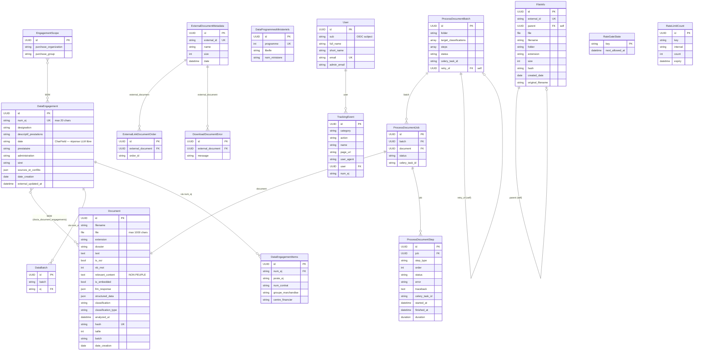

# Schéma de base de données

## Diagramme ER

## Tables par domaine

### Domaine métier (Documents)

| Table Django | Table SQL | Rôle |
|---|---|---|
| `Document` | `docia_document` | Document avec texte extrait, classification et données structurées |
| `DataEngagement` | `engagements` | Engagement juridique (EJ) synchronisé depuis Chorus |
| `DataEngagementItems` | `engagements_items` | Postes d'un EJ (numéro contrat, groupe marchandise, centre financier) |
| `DataBatch` | `batch` | Association batch legacy → EJ |
| `EngagementScope` | `docia_engagementscope` | Périmètre d'accès (purchase org/group) |
| `DataProgrammesMinisteriels` | `programmes_ministeriels` | Référentiel programmes ministériels |

### Domaine pipeline

| Table Django | Table SQL | Rôle |
|---|---|---|
| `ProcessDocumentBatch` | `docia_processdocumentbatch` | Batch de traitement (folder, steps, status) |
| `ProcessDocumentJob` | `docia_processdocumentjob` | Job par document dans un batch |
| `ProcessDocumentStep` | `docia_processdocumentstep` | Étape d'un job (type, status, error, duration) |
| `FileInfo` | `docia_fileinfo` | Métadonnées fichier téléchargé |
| `ExternalDocumentMetadata` | `docia_externaldocumentmetadata` | Métadonnées document API externe |
| `ExternalLinkDocumentOrder` | `docia_externallinkdocumentorder` | Lien document → order ID externe |
| `DownloadDocumentError` | `docia_downloaddocumenterror` | Erreurs de téléchargement |

### Domaine technique

| Table Django | Table SQL | Rôle |
|---|---|---|
| `User` | `docia_user` | Utilisateur OIDC (ProConnect) |
| `TrackingEvent` | `docia_trackingevent` | Événements de suivi UI |
| `RateGateState` | `docia_rategatestate` | État du rate limiter LLM |
| `RateLimitCount` | `docia_ratelimitcount` | Compteurs rate limiting web |

!!! warning "Conventions de nommage mixtes"

    Les tables `engagements`, `engagements_items`, `batch`, `programmes_ministeriels` utilisent des noms personnalisés (`Meta.db_table`), tandis que les autres suivent la convention Django (`docia_*`). Cela reflète l'héritage du code legacy.

**Source** : `docia/documents/models.py`, `docia/file_processing/models.py`, `docia/common/models.py`, migrations
