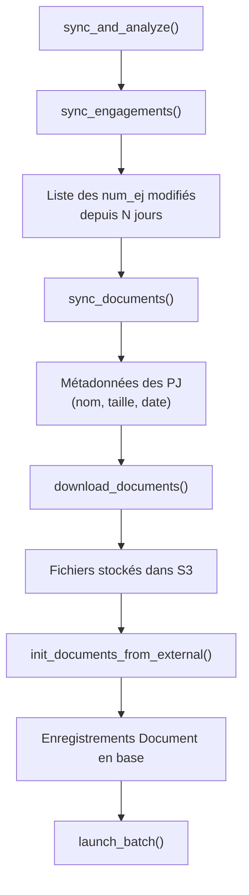

# Ingestion

## Source des documents

Les documents proviennent de l'**API Chorus/SAP** via un mécanisme de synchronisation automatique.

### Client de synchronisation

**Fichier** : `docia/file_processing/sync/client.py`

Le `SyncClient` utilise :

- **Protocole** : OData (REST)
- **Authentification** : OAuth2 `client_credentials`
- **Format de date propriétaire** : `/Date(<timestamp>)/` (format OData legacy)

### Étapes de synchronisation



### Synchronisation des engagements

**Fichier** : `docia/file_processing/sync/sync_engagements.py`

1. Appelle l'API externe pour lister les EJ modifiés sur la période
2. Crée ou met à jour les enregistrements `DataEngagement` en base
3. Synchronise les `DataEngagementItems` (postes EJ, contrats, groupes marchandise)

### Téléchargement des documents

**Fichier** : `docia/file_processing/sync/downloader.py`

| Paramètre | Valeur | Source |
|---|---|---|
| Retry si taille < 21 Mo | 2 tentatives | Code en dur |
| Retry si taille ≥ 21 Mo | 0 tentative | Code en dur |
| Stockage | S3 via `django-storages` ou filesystem | `DEFAULT_FILE_STORAGE` |
| Dédoublonnage | Hash SHA256 du fichier | `FileInfo.hash` |

### Formats supportés

```python
SUPPORTED_FILES_TYPE = [
    "doc", "docx", "odt", "pdf", "txt",
    "jpg", "jpeg", "png", "tiff", "tif",
    "xlsx", "xls", "ods",
]
```

Les fichiers avec une extension non supportée sont **ignorés** (`SkipStepException`).

!!! warning "Pas de limite de taille fichier"

    Il n'existe pas de limite de taille explicite dans le code. Le téléchargement tente sans retry les fichiers > 21 Mo mais ne les bloque pas.

**Source** : `docia/file_processing/sync/`, `docia/file_processing/processor/text_extraction/text_extraction.py`
