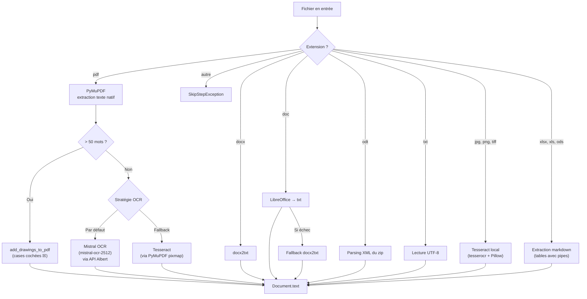

# OCR & Extraction de texte

## Étape 1 du pipeline : `task_extract_text`

**Fichiers** :

- `docia/file_processing/pipeline/steps/text_extraction.py` — Step runner Celery
- `docia/file_processing/processor/text_extraction/text_extraction.py` — Dispatch par format

## Stratégie par format

## Détail par format

### PDF (natif)

1. Extraction texte via **PyMuPDF** (`fitz`)
2. Si le texte contient **> 50 mots** → considéré comme PDF natif
3. Étape supplémentaire : `add_drawings_to_pdf()` détecte les **cases cochées** (☒) dans les dessins vectoriels du PDF et les ajoute au texte extrait
4. **Source** : `docia/file_processing/processor/pdf_drawings.py`

### PDF (scanné — < 50 mots)

1. **Par défaut** : envoi à **Mistral OCR** (`mistral-ocr-2512`) via API Albert
    - Appel REST direct (`httpx.post` vers `/ocr`)
    - Le PDF est encodé en base64 et envoyé comme `document_url`
    - La réponse contient des pages avec du markdown
    - Reconstruction du texte avec marqueurs `[[PAGE i / N]]`
2. **Fallback** : OCR Tesseract local (si Mistral OCR échoue ou désactivé)
    - Rendu pixmap via PyMuPDF → OCR Tesseract page par page

### Images (JPG, PNG, TIFF)

- OCR **Tesseract local** via `tesserocr` + `Pillow`
- Pas d'appel à Mistral OCR pour les images

### Documents Office

| Format | Outil | Particularité |
|---|---|---|
| DOCX | `docx2txt` | — |
| DOC | LibreOffice → txt | Fallback `docx2txt` si échec |
| ODT | Parsing XML du zip | Extraction directe du `content.xml` |
| XLSX, XLS | `openpyxl` / `xlrd` | Converti en tables markdown (`\|`) |
| ODS | `openpyxl` | Identique à XLSX |

### Texte brut

- Lecture directe en UTF-8

## Champs peuplés

| Champ | Type | Description |
|---|---|---|
| `Document.text` | `TextField` | Texte extrait complet |
| `Document.is_ocr` | `BooleanField` | `True` si OCR utilisé |
| `Document.nb_mot` | `IntegerField` | Nombre de mots extraits |

!!! info "Seuil OCR : 50 mots"

    Le seuil de 50 mots pour décider si un PDF est natif ou scanné est codé en dur. Un PDF avec des images contenant du texte mais aussi quelques lignes de métadonnées (> 50 mots) ne sera pas envoyé en OCR.

**Source** : `docia/file_processing/processor/text_extraction/text_extraction.py`, `docia/file_processing/llm/client.py`
