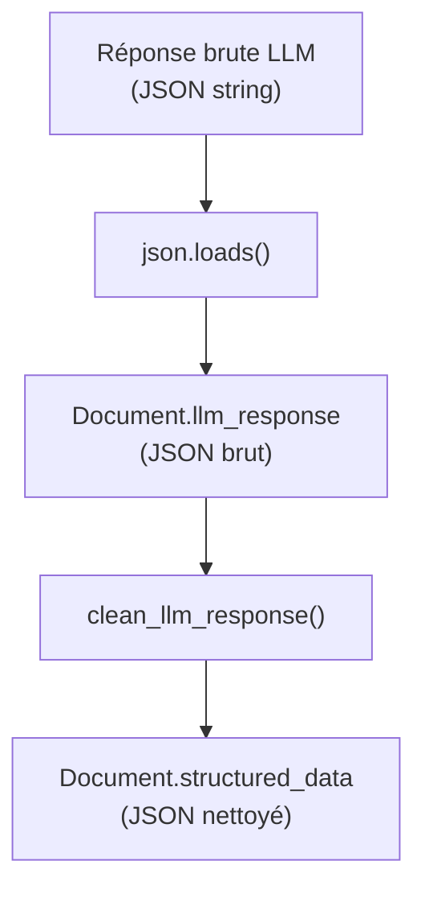

# Parsing de la réponse LLM

## Flux de parsing



## Response format (JSON Schema strict)

Le LLM est contraint de produire du JSON valide par l'API Albert via `response_format` :

```python
# docia/file_processing/processor/analyze_content.py (verbatim)
response_format = {
    "type": "json_schema",
    "json_schema": {
        "name": f"{classification}",
        "schema": {
            "type": "object",
            "properties": properties,   # Généré dynamiquement
            "required": l_output_field,  # Tous les champs requis
        },
    },
}
```

Chaque attribut a un schéma typé :

- **String** : `{"type": ["string", "null"]}` (par défaut)
- **Object** : ex. `forme_marche`, `rib_mandataire`, `duree`, `adresse_postale_titulaire`
- **Array** : ex. `cotraitants`, `sous_traitants`, `rib_autres`, `lots`
- **Schémas complexes** : `oneOf` pour `forme_marche` du CCAP (structure allotie vs simple)

## Post-traitement (`clean_llm_response`)

**Fichier** : `docia/file_processing/processor/post_processing_llm.py`

Après parsing JSON, chaque champ est nettoyé par des fonctions spécialisées regroupées dans `CLEAN_FUNCTIONS` :

```python
# docia/file_processing/processor/post_processing_llm.py — schématique
CLEAN_FUNCTIONS = {
    "acte_engagement": {
        "siret_mandataire": post_processing_siret,    # ← 14 chiffres
        # siren_mandataire : absent de CLEAN_FUNCTIONS → champ passé brut, aucun nettoyage
        "rib_mandataire": post_processing_bank_account,
        "cotraitants": post_processing_co_contractors,
        "sous_traitants": post_processing_subcontractors,
        "rib_autres": post_processing_other_bank_accounts,
        "montant_ht": post_processing_amount,
        "montant_ttc": post_processing_amount,
        "montant_tva": post_processing_percentage,
        "societe_principale": post_processing_societe_principale,
        "duree": post_processing_duration,
    },
    "rib": {
        "iban": post_processing_iban,
        "bic": post_processing_bic,
        "adresse_postale_titulaire": post_processing_postal_address,
    },
    ...
}
```

!!! warning "Champ `siren_mandataire` non nettoyé"
    Le champ `siren_mandataire` (acte d'engagement) **n'a pas de fonction de nettoyage dédiée** dans `CLEAN_FUNCTIONS` (`post_processing_llm.py`). Il est passé tel quel depuis la réponse LLM vers `Document.structured_data`. Une validation 9 chiffres serait souhaitable.

### Fonctions de nettoyage notables

| Fonction | Rôle | Bibliothèque |
|---|---|---|
| `post_processing_iban` | Validation IBAN (ISO 13616) + correction 1 char OCR (IBAN FR uniquement) | `schwifty` |
| `post_processing_siret` | Suppression espaces, vérification 14 chiffres | — |
| `post_processing_amount` | Extraction montant numérique, suppression `€`, séparateurs | — |
| `post_processing_percentage` | Extraction pourcentage numérique | — |
| `post_processing_societe_principale` | Suppression préfixes/suffixes juridiques (SAS, SARL…) | — |
| `post_processing_duration` | Parsing dictionnaire durée → validation champs requis (raise ValueError si manquants) | — |
| `post_processing_bank_account` | Validation structure RIB : IBAN ou reconstruction depuis composants | `schwifty` |
| `post_processing_co_contractors` | Nettoyage SIRET de chaque cotraitant | — |
| `post_processing_postal_address` | Normalisation adresse : code postal 5 chiffres, pays par défaut France | — |

!!! note "`siren_mandataire` sans nettoyage"
    Il n'existe pas de fonction `post_processing_siren` dans le code. Le champ `siren_mandataire` n'est **pas présent dans `CLEAN_FUNCTIONS`** et est passé brut depuis la réponse LLM. Contrairement à `siret_mandataire` (validé à 14 chiffres), le SIREN extrait n'est soumis à aucune validation automatique. L'équipe décrit une intention de validation (9 chiffres, suppression espaces) — **non encore implémentée** dans le code actuel.

!!! danger "Risque de perte de données"

    Si le post-traitement lève une exception (ex. `ValueError` dans `post_processing_duration` pour des champs manquants), l'étape est marquée en `FAILURE`. La `llm_response` brute n'est **pas sauvegardée** car le `save()` n'est pas atteint. La réponse du LLM est perdue.

## Champs peuplés

| Champ | Type | Contenu |
|---|---|---|
| `Document.llm_response` | `JSONField` | Réponse brute du LLM (avant nettoyage) |
| `Document.structured_data` | `JSONField` | Données nettoyées par `clean_llm_response()` |
| `Document.analyzed_at` | `DateTimeField` | Horodatage de l'analyse |

**Source** : `docia/file_processing/processor/analyze_content.py`, `docia/file_processing/processor/post_processing_llm.py`
