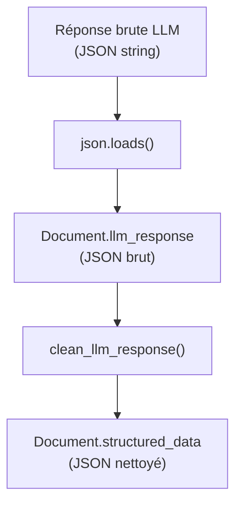

# Parsing de la réponse LLM

## Flux de parsing



## Response format (JSON Schema strict)

Le LLM est contraint de produire du JSON valide par l'API Albert via `response_format` :

```python
# docia/file_processing/processor/analyze_content.py (verbatim)
response_format = {
    "type": "json_schema",
    "json_schema": {
        "name": f"{classification}",
        "schema": {
            "type": "object",
            "properties": properties,   # Généré dynamiquement
            "required": l_output_field,  # Tous les champs requis
        },
    },
}
```

Chaque attribut a un schéma typé :

- **String** : `{"type": ["string", "null"]}` (par défaut)
- **Object** : ex. `forme_marche`, `rib_mandataire`, `duree`, `adresse_postale_titulaire`
- **Array** : ex. `cotraitants`, `sous_traitants`, `rib_autres`, `lots`
- **Schémas complexes** : `oneOf` pour `forme_marche` du CCAP (structure allotie vs simple)

## Post-traitement (`clean_llm_response`)

**Fichier** : `docia/file_processing/processor/post_processing_llm.py`

Après parsing JSON, chaque champ est nettoyé par des fonctions spécialisées regroupées dans `CLEAN_FUNCTIONS` :

```python
# Mapping type_document → {champ: fonction_nettoyage}
CLEAN_FUNCTIONS = {
    "acte_engagement": {
        "siret_mandataire": post_processing_siret,
        "siren_mandataire": post_processing_siren,
        "rib_mandataire": post_processing_rib,
        "cotraitants": post_processing_cotraitants,
        "rib_autres": post_processing_rib_autres,
        "montant_ht": post_processing_amount,
        "montant_ttc": post_processing_amount,
        "societe_principale": post_processing_societe_name,
        "administration_beneficiaire": post_processing_admin_name,
        "duree": post_processing_duration,
        ...
    },
    "rib": {
        "iban": post_processing_iban,
        ...
    },
    ...
}
```

### Fonctions de nettoyage notables

| Fonction | Rôle | Bibliothèque |
|---|---|---|
| `post_processing_iban` | Validation IBAN (ISO 13616) | `schwifty` |
| `post_processing_siret` | Nettoyage : suppression espaces, vérification 14 chiffres | — |
| `post_processing_siren` | Nettoyage : suppression espaces, vérification 9 chiffres | — |
| `post_processing_amount` | Extraction montant numérique, suppression `€`, séparateurs | — |
| `post_processing_societe_name` | Suppression préfixes/suffixes juridiques parasites | — |
| `post_processing_admin_name` | Normalisation nom administration | — |
| `post_processing_duration` | Parsing JSON durée → validation champs requis | — |
| `post_processing_rib` | Validation structure RIB (IBAN ou composants) | — |
| `post_processing_cotraitants` | Nettoyage SIRET de chaque cotraitant | — |

!!! danger "Risque de perte de données"

    Si le post-traitement lève une exception (ex. `ValueError` dans `post_processing_duration` pour des champs manquants), l'étape est marquée en `FAILURE`. La `llm_response` brute n'est **pas sauvegardée** car le `save()` n'est pas atteint. La réponse du LLM est perdue.

## Champs peuplés

| Champ | Type | Contenu |
|---|---|---|
| `Document.llm_response` | `JSONField` | Réponse brute du LLM (avant nettoyage) |
| `Document.structured_data` | `JSONField` | Données nettoyées par `clean_llm_response()` |
| `Document.analyzed_at` | `DateTimeField` | Horodatage de l'analyse |

**Source** : `docia/file_processing/processor/analyze_content.py`, `docia/file_processing/processor/post_processing_llm.py`
