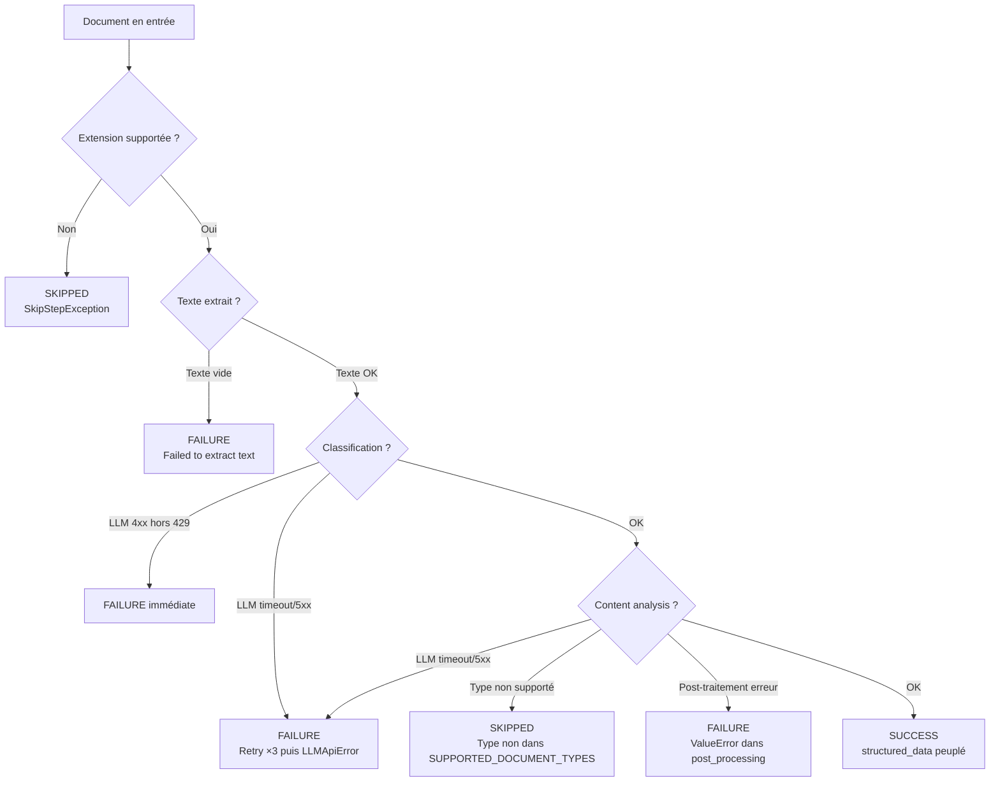

# Cas d'échec

## Taxonomie des échecs



## Détail des cas d'échec

### 1. Extension non supportée → `SKIPPED`

| Déclencheur | Le fichier a une extension hors `SUPPORTED_FILES_TYPE` |
|---|---|
| Résultat | `SkipStepException` → le document est marqué `SKIPPED` |
| Perte de données | Aucune — le document n'est pas traité |
| Extensions courantes non gérées | `.csv`, `.msg`, `.eml`, `.ppt`, `.pptx`, `.rtf` |

### 2. Texte vide après extraction → `FAILURE`

| Déclencheur | Extraction texte produit un résultat vide |
|---|---|
| Résultat | `Exception("Failed to extract text - empty result")` → `FAILURE` |
| Cause probable | PDF corrompu, image illisible, fichier protégé |

### 3. LLM timeout ou erreur serveur → `FAILURE` (après retry)

| Déclencheur | HTTP 429, 5xx, timeout, erreur réseau |
|---|---|
| Comportement | 3 retries avec backoff exponentiel |
| Délai 429 | 60s × (attempt+1) × jitter |
| Délai 5xx | 10s × (attempt+1) × jitter |
| Si toutes tentatives échouent | `LLMApiError` → Step `FAILURE` |

### 4. LLM erreur client → `FAILURE` immédiate

| Déclencheur | HTTP 4xx (hors 429) |
|---|---|
| Comportement | Pas de retry, échec immédiat |
| Cause probable | Payload invalide, modèle inexistant |

### 5. Post-traitement → `FAILURE`

| Déclencheur | Exception dans `clean_llm_response()` |
|---|---|
| Exemples | `ValueError` dans `post_processing_duration` (champs manquants), erreur IBAN |
| Conséquence critique | **La `llm_response` brute est perdue** car le `save()` n'est pas atteint |

!!! danger "Perte de données en post-traitement"

    Si le post-traitement lève une exception, l'étape est marquée `FAILURE` et la réponse brute du LLM n'est pas sauvegardée. Cela signifie qu'une extraction correcte du LLM peut être perdue à cause d'un bug de post-traitement. C'est un risque identifié dans l'audit.

### 6. Batch bloqué → `CANCELLED` + retry automatique

| Déclencheur | Batch sans mise à jour depuis 30 minutes |
|---|---|
| Comportement | `close_and_retry_stuck_batches()` annule le batch et relance les jobs échoués |
| Nouveau batch | `retry_of` pointe vers l'ancien batch |

### 7. Document > 21 Mo → téléchargement sans retry

| Déclencheur | `doc.size_mo >= 21` |
|---|---|
| Comportement | 1 seule tentative de téléchargement (pas de retry) |
| Le document est quand même téléchargé | Oui, mais sans filet de sécurité |

## Propagation des erreurs

Le `AbstractStepRunner` capture les exceptions, marque le step en `FAILURE`, enregistre l'erreur et le traceback, et **annule les étapes suivantes** du même job :

```
Step FAILURE → Job FAILURE → les steps suivants du même job sont CANCELLED
                            → les autres jobs du batch continuent
```

Le batch global ne passe en `FAILURE` que si **tous** ses jobs échouent.

## Ce qui n'est pas géré

| Scénario | Conséquence |
|---|---|
| Dépassement fenêtre de contexte LLM | Réponse tronquée ou erreur 400 non documentée |
| Hallucination du LLM | Acceptée silencieusement (pas de score de confiance) |
| Document multi-langue | Pas de détection de langue, prompts en français uniquement |
| PDF chiffré/protégé | Erreur d'extraction (PyMuPDF) → texte vide → `FAILURE` |
| Fichier corrompu (hash OK mais contenu cassé) | Erreur variable selon le format |

**Source** : `docia/file_processing/pipeline/steps/base.py`, `docia/file_processing/llm/client.py`, `docia/file_processing/processor/post_processing_llm.py`, `docia/file_processing/pipeline/pipeline.py`
