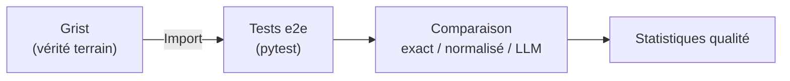

# Scores de confiance

## État actuel

!!! danger "Aucun score de confiance implémenté"

    Le pipeline ne produit **aucun score de confiance, probabilité ou incertitude** sur les données extraites.

### Ce qui existe

- **Température à 0.0** : le LLM est appelé en mode déterministe (`temperature=0.0`), ce qui réduit la variabilité des réponses mais ne fournit pas de score.
- **Taux de remplissage** : pourcentage de champs non vides dans `structured_data` (voir [Métriques existantes](metriques-existantes.md)).
- **Post-traitement strict** : les fonctions de nettoyage rejettent les valeurs malformées (IBAN invalide, SIRET incorrect), ce qui constitue une forme de validation binaire.

### Ce qui manque

| Mécanisme absent | Impact |
|---|---|
| Score de confiance par champ | Impossible de prioriser la vérification humaine |
| Log-probabilities du LLM | Non demandé dans l'appel API (`logprobs` non activé) |
| Double extraction avec comparaison | Pas de mécanisme de consensus |
| Seuil de rejet automatique | Toutes les réponses sont acceptées sauf erreur de parsing |
| Classification multi-label avec scores | Seule la première catégorie est retenue |

## Recommandations pour SAP Chorus

!!! tip "Pistes d'amélioration — à discuter en atelier 2"

    1. **Activer `logprobs`** dans l'appel API Albert (si supporté) pour obtenir les log-probabilités token par token
    2. **Double extraction** : appeler le LLM 2 fois avec des températures légèrement différentes et comparer les résultats
    3. **Score de remplissage pondéré** : attribuer un poids aux champs critiques SAP (SIRET, montant, IBAN)
    4. **Validation croisée inter-documents** : comparer le SIRET extrait de l'acte d'engagement avec celui du Kbis ou de l'attestation SIRENE
    5. **Seuil de confiance** : définir un seuil sous lequel le document est flaggé pour vérification humaine

## Données de validation existantes

La seule source de vérité terrain est dans **Grist** (base collaborative), utilisée par les tests e2e :

Le processus de labellisation (qui maintient Grist à jour) n'est pas documenté dans le code.

**Source** : `docia/views.py`, `docia/file_processing/llm/client.py`, `tests_e2e/`
